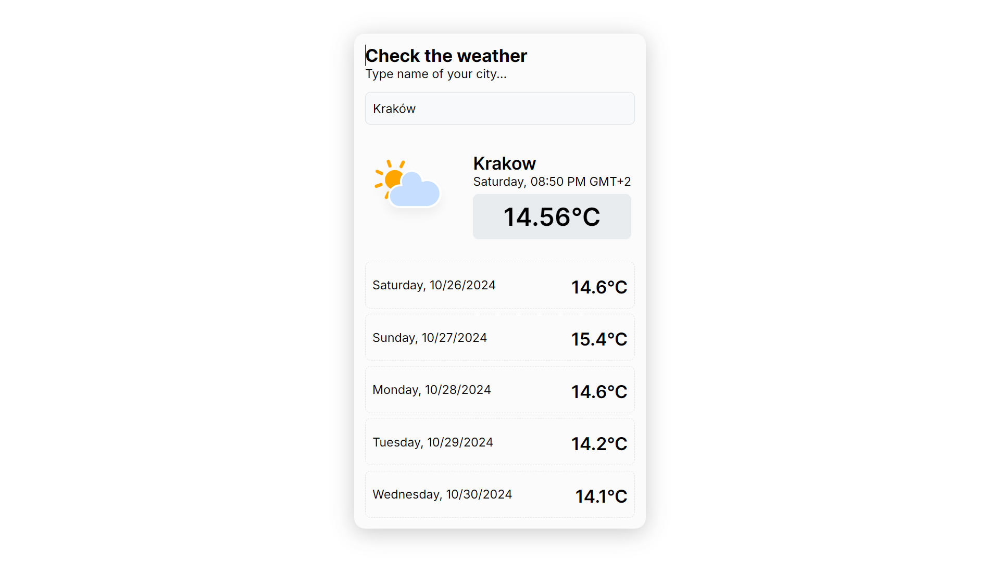

# Weather Forecast App

## Table of Contents

- [Features](#features)
- [Technologies Used](#technologies-used)
- [Setup](#setup)
- [Usage](#usage)
- [License](#license)


## Description
A React application that provides current weather information and a 5-day forecast for any city. Users can search for a location to view real-time weather conditions.
The app features a dynamic icon component that changes icons based on the current conditions, offering a visual representation that enhances the user experience.



Live Demo [here](https://rwf-jk.vercel.app/).

## Features

- **Current Weather**: Displays real-time weather conditions for the selected city.
- **5-Day Forecast**: Provides daily maximum temperatures for the next five days.
- **Dynamic Weather Icons**: Shows different icons based on the time of day and weather conditions.
- **City Search**: Allows users to search for a city's weather.

## Technologies Used

- **React**: Front-end JavaScript library for building the user interface.
- **Vite**: A fast build tool for modern web projects.
- **Sass**: For styling components.
- **ESLint & Prettier**: Code linting and formatting tools for a consistent codebase.
- **React Icons**: A library that includes customizable icons in your project.
- **OpenWeather API**: Used to fetch weather and forecast data.

## Setup

To run this project, install it locally using npm:
1.Enter project directory
```
$ cd ../lorem
```
2. Install packages
```
$ npm install
```
3. Run the development server locally
```
$ npm run dev
```

## License

This project is licensed under the MIT License. See the [LICENSE](./LICENSE) file for details.
